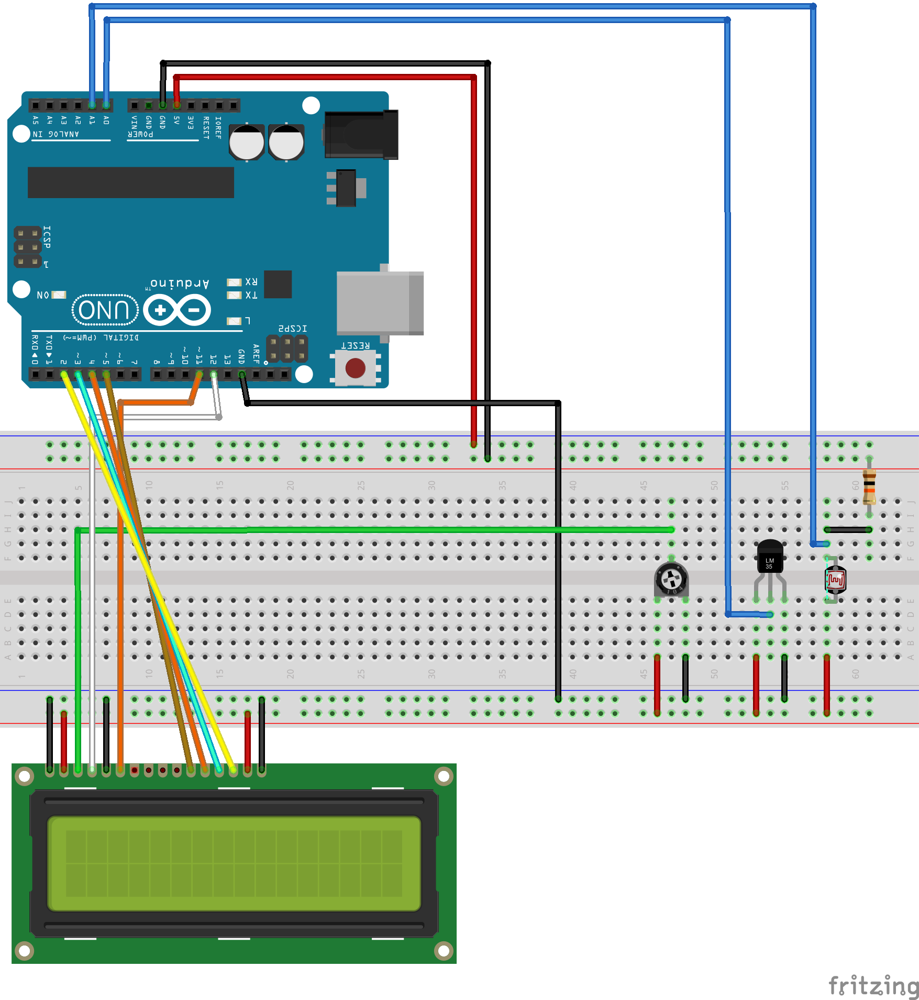

# tmpchckr
## temperature checker

A little Arduino software made for fun, and to get acquaintanced with Arduino environment.

## What does it do?

It obtains temperature and light reading from sensors (LM35 and photoresistor), and displays it on LCD screen.

Moreover, every now and then, those readings are stored in EEPROM. Right now that happens on three occasions:

- at the beginning,
- when light value changes for more than 35% since last reading,
- after 30 minutes.

Upon every save, timer is reset. Additionally, after Arduino is turned on, it will continue from where it was before turning off.

## Commands

There are two commands you can use. Both needs to be sent over serial (9600 bps).

- `READ` - writes stored values to serial output, separated by comma: `timedelta,light,temperature`
  - `timedelta` is number of minutes since previous entry
  - `light` is percentage value of light
  - `temperature` is centigrade value of temperature decremented by 10 (in order to fit into single byte) and multiplied by 10
- `CLEAR`: removes all entries from memory, and starts anew.
  - after sending this command, you need to confirm it by sending `YES`. All other values will cause Arduino to revert to standard loop.

## Schema

## Quirks

Since EEPROM holds just 1024 bytes (and unsigned byte has just 0-255 values), I'm storing temperature in centigrades multiplied by 10 (so 23.5"C becomes 235). Moreover, a hundred is substracted from that (`235 - 100 = 135`), so that there's room for temperatures over 25"C.

## Todo

- improve detecting whether light value changed over time - right now, simple array of 10 last values is stored, and current value is compared to it.
